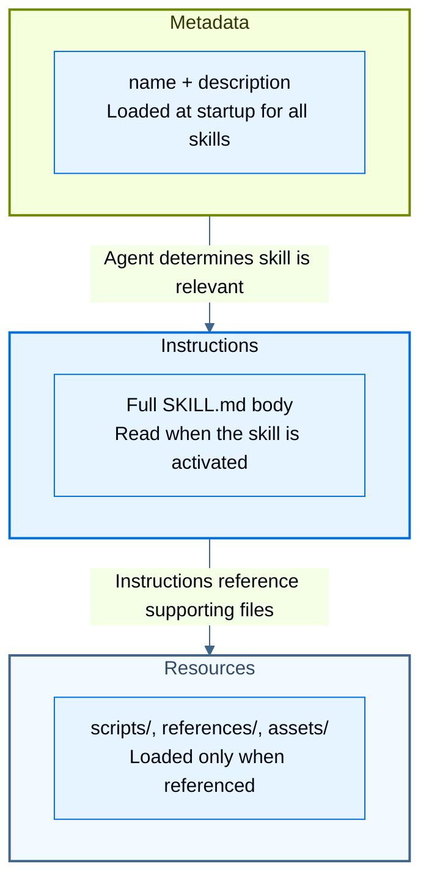

import SkillsUsageTabsPy from '/snippets/skills-usage-tabs-py.mdx';
import SkillsUsageTabsJs from '/snippets/skills-usage-tabs-js.mdx';
import SkillsSandboxPy from '/snippets/code-samples/skills-sandbox-py.mdx';
import SkillsSandboxJs from '/snippets/code-samples/skills-sandbox-js.mdx';
import BackendReadonlySkillsPy from '/snippets/code-samples/backend-readonly-skills-py.mdx';
import BackendReadonlySkillsJs from '/snippets/code-samples/backend-readonly-skills-js.mdx';

As agents take on more complex tasks, the context they need grows with them. Loading all instructions into the system prompt wastes tokens on information irrelevant to the current task, and providing the same guidance manually across sessions does not scale.

Skills solve this by packaging domain expertise, such as workflows, best practices, scripts, reference docs, and templates, into reusable directories. The agent gets a summary of the contents on startup and discovers and reads the contained files only when relevant.

:::js
<Note>
Skills require `deepagents>=1.7.0`.
</Note>
:::

Deep agent skills follow the [Agent Skills specification](https://agentskills.io/specification).

<Tip>
For ready-to-use skills that improve your agent's performance on LangChain ecosystem tasks, see the [LangChain Skills](https://github.com/langchain-ai/langchain-skills) repository.
</Tip>

## What are skills

Each skill is a directory containing a `SKILL.md` file: a markdown file with YAML frontmatter (`name` and `description`) followed by instructions the agent follows when the skill is activated. A skill directory can also include supporting files such as scripts, reference docs, and templates.

```plaintext
skills/
└── langgraph-docs/
    └── SKILL.md
```

The `SKILL.md` starts with YAML frontmatter followed by markdown instructions:

````md
---
name: langgraph-docs
description: Use this skill for requests related to LangGraph in order to fetch relevant documentation to provide accurate, up-to-date guidance.
---

# langgraph-docs

## Overview

This skill explains how to access LangGraph documentation to help answer questions and guide implementation.

## Instructions

### 1. Fetch the documentation index

Use the fetch_url tool to read the following URL:
https://docs.langchain.com/llms.txt

This provides a structured list of all available documentation with descriptions.

### 2. Select relevant documentation

Based on the question, identify 2-4 most relevant documentation URLs from the index. Prioritize:

- Specific how-to guides for implementation questions
- Core concept pages for understanding questions
- Tutorials for end-to-end examples
- Reference docs for API details

### 3. Fetch and synthesize

Use the fetch_url tool to read the selected documentation URLs, then answer the user's question. Give a direct answer first, include the minimum necessary context, and link to the source pages rather than quoting long passages.
````

<Note>
    Reference any supporting files in your `SKILL.md` with a description of what each file contains and when to use it. The agent discovers these files through the references in the skill instructions.
</Note>

Skills use *progressive disclosure*: the agent loads skill information in layers, pulling in more detail only when the task calls for it.



In Deep Agents, `SkillsMiddleware` handles this in three stages:

1. **Discovery**: At agent start, the middleware scans the configured skill paths, parses each `SKILL.md` frontmatter, and injects skill names and descriptions into the system prompt.
2. **Read**: When the agent determines a skill matches the current task, it reads the full `SKILL.md` content via `read_file`. There is no dedicated activation mechanism.
3. **Execute**: The agent follows the skill's instructions and reads any supporting files (scripts, references, assets) as needed.

The [Agent Skills specification](https://agentskills.io/specification) recommends keeping frontmatter concise and the `SKILL.md` body under 5,000 tokens. Following these guidelines matters because every skill's frontmatter is added to the system prompt at discovery, while the full body is only read when activated. Keeping both layers small means you can load many skills without crowding the context window.

<Tip>
    Write clear, specific descriptions in your `SKILL.md` frontmatter. The agent decides whether to activate a skill based on the description alone. Include specific keywords and use cases so the agent can match accurately.
</Tip>

## Usage

Create a top level skills directory. Then create a directory inside that with a `SKILL.md` file for your first skill. Finally, pass the path to the top level skills directory when creating your agent:

:::python
```python
from deepagents import create_deep_agent
from deepagents.backends.filesystem import FilesystemBackend

backend = FilesystemBackend(root_dir="./my-project")

agent = create_deep_agent(
    model="anthropic:claude-sonnet-4-6",
    backend=backend,
    skills=["./my-project/skills/"],
)

result = agent.invoke(
    {"messages": [{"role": "user", "content": "What is LangGraph?"}]},
    config={"configurable": {"thread_id": "1"}},
)
```
:::

:::js
```typescript
import { createDeepAgent, FilesystemBackend } from "deepagents";

const backend = new FilesystemBackend({ rootDir: process.cwd() });

const agent = await createDeepAgent({
  model: "anthropic:claude-sonnet-4-6",
  backend,
  skills: ["/skills/"],
});

const result = await agent.invoke(
  { messages: [{ role: "user", content: "What is LangGraph?" }] },
  { configurable: { thread_id: "1" } },
);
```
:::

This example uses `FilesystemBackend` to load skills from disk. For other storage options, including loading skills from remote sources, see [Backends and remote skill loading](#backends-and-remote-skill-loading).

<ParamField body="skills" type="list[str]" optional>
    List of skill source paths.

    Paths must be specified using forward slashes and are relative to the backend's root.

    - If omitted, no skills are loaded.
    - When using `StateBackend` (default), provide skill files with `invoke(files={...})`. Use `create_file_data()` from `deepagents.backends.utils` to format file contents; raw strings are not supported.
    - With `FilesystemBackend`, skills are loaded from disk relative to the backend's `root_dir`.

    Later sources override earlier ones for skills with the same name (last one wins).
</ParamField>

<Note>
    When multiple skill sources contain a skill with the same name, the skill from the source listed later in the `skills` array takes precedence (last one wins). This lets you layer skills from different origins, such as base skills overridden by project-specific versions.
</Note>

## Write effective skills

The [Agent Skills specification](https://agentskills.io/specification) includes guidance on structuring skills for reliable discovery and activation. The following recommendations build on that foundation with practical patterns for Deep Agents.

**Write specific descriptions.** During [discovery](#what-are-skills), the `description` field is the only information the agent sees for each skill. A good description tells the agent both what the skill does and when to activate it, with specific keywords the agent can match against:

```yaml
# Good: specific about what and when
description: >-
  Extract text and tables from PDF files, fill PDF forms, and merge
  multiple PDFs. Use when working with PDF documents or when the user
  mentions PDFs, forms, or document extraction.

# Poor: too vague for reliable matching
description: Helps with PDFs.
```

When you have multiple skills in related domains, differentiate their descriptions clearly. Overlapping descriptions cause the agent to activate the wrong skill or hesitate between options. If two skills serve similar purposes, consolidate them into one.

**Keep instructions focused.** The Agent Skills specification recommends keeping your `SKILL.md` under 500 lines. When instructions grow longer, move detailed reference material into separate files and reference them from the main `SKILL.md`:

```plaintext
skills/
└── data-pipeline/
    ├── SKILL.md
    └── references/
        ├── schema-reference.md
        └── error-codes.md
```

The agent loads reference files only when the instructions call for them, keeping each layer of progressive disclosure appropriately sized. Keep file references one level deep from `SKILL.md` and avoid deeply nested reference chains, which force the agent through multiple reads to reach the information it needs.

**Structure instructions for the agent.** Write your `SKILL.md` body as clear instructions the agent can follow:

- **Step-by-step procedures** for multi-step workflows
- **Decision criteria** for choosing between approaches
- **Examples of expected inputs and outputs** so the agent knows what success looks like
- **Edge cases** the agent should handle or flag to the user

**Manage skill count.** Fewer well-scoped skills outperform many overlapping ones. As the number of skills with similar descriptions grows, the agent's ability to select the right one degrades. If you find yourself with many related skills, consider:

- Consolidating related capabilities into a single skill with sections for each sub-task
- Using reference files to keep the main `SKILL.md` concise while covering multiple sub-tasks

<Tip>
    Use the [`skills-ref` validation tool](https://github.com/agentskills/agentskills/tree/main/skills-ref) to check that your `SKILL.md` frontmatter follows the Agent Skills specification naming and format conventions.
</Tip>

## Backends and remote skill loading

Deep Agents supports different backends depending on how you want to store and manage skill files:

- `StateBackend`: Stores files in LangGraph agent state for the current thread.
- `StoreBackend`: Stores files in a LangGraph store for durable, cross-thread storage.
- `FilesystemBackend`: Reads and writes skill files from disk under a configurable `root_dir`.

:::python
<SkillsUsageTabsPy />
:::

:::js
<SkillsUsageTabsJs />
:::

## Load skills at runtime

When you have a large collection of skills but only a subset is relevant for a given run, select which skills to load based on runtime context such as user role, tenant, or request type. There are two main approaches:

### Dynamic skill lists

The simplest approach is to construct the `skills` array before creating the agent. Choose which skill paths to include based on whatever runtime context you have:

:::python
```python
from deepagents import create_deep_agent

SKILLS_BY_ROLE = {
    "engineering": ["/skills/code-review/", "/skills/testing/", "/skills/deployment/"],
    "data": ["/skills/sql-analysis/", "/skills/visualization/", "/skills/data-pipeline/"],
    "support": ["/skills/ticket-triage/", "/skills/runbook/"],
}

def create_agent_for_user(user_role: str):
    return create_deep_agent(
        model="anthropic:claude-sonnet-4-6",
        skills=SKILLS_BY_ROLE.get(user_role, []),
    )
```
:::

:::js
```typescript
import { createDeepAgent } from "deepagents";

const SKILLS_BY_ROLE: Record<string, string[]> = {
  engineering: ["/skills/code-review/", "/skills/testing/", "/skills/deployment/"],
  data: ["/skills/sql-analysis/", "/skills/visualization/", "/skills/data-pipeline/"],
  support: ["/skills/ticket-triage/", "/skills/runbook/"],
};

function createAgentForUser(userRole: string) {
  return createDeepAgent({
    model: "anthropic:claude-sonnet-4-6",
    skills: SKILLS_BY_ROLE[userRole] ?? [],
  });
}
```
:::

This works well when skills live on disk or in a shared backend and you just need to control which ones the agent sees. The skills themselves are not duplicated — you maintain one copy and vary the paths passed to each run.

### Namespaced skills

For multi-tenant applications where each user's skill set is managed independently, route `/skills/` to a @[StoreBackend] with a namespace factory. Populate each namespace with only the skills that user should have access to, and the middleware resolves to the correct set at runtime:

:::python
```python
from deepagents import create_deep_agent
from deepagents.backends import CompositeBackend, StateBackend, StoreBackend

agent = create_deep_agent(
    model="anthropic:claude-sonnet-4-6",
    skills=["/skills/"],
    backend=CompositeBackend(
        default=StateBackend(),
        routes={
            "/skills/": StoreBackend(
                namespace=lambda rt: (
                    rt.server_info.assistant_id,
                    rt.server_info.user.identity,
                ),
            ),
        },
    ),
)
```
:::

:::js
```typescript
import {
  createDeepAgent,
  CompositeBackend,
  StateBackend,
  StoreBackend,
} from "deepagents";

const agent = await createDeepAgent({
  model: "anthropic:claude-sonnet-4-6",
  skills: ["/skills/"],
  backend: new CompositeBackend({
    default: new StateBackend(),
    routes: {
      "/skills/": new StoreBackend({
        namespace: (ctx) => [
          ctx.assistantId ?? "default",
          ctx.config?.configurable?.user_id ?? "anonymous",
        ],
      }),
    },
  }),
});
```
:::

This pattern is useful when different users or tenants need fully independent skill libraries that can be updated separately. For a managed solution that handles skill access, sharing, and workspace-level visibility out of the box, see [Fleet skills](/langsmith/fleet/skills).

## Skills for subagents

When you use [subagents](/oss/deepagents/subagents), you can configure which skills each type has access to:

- **General-purpose subagent**: Automatically inherits skills from the main agent when you pass `skills` to `create_deep_agent`. No additional configuration is needed.
- **Custom subagents**: Do not inherit the main agent's skills. Add a `skills` parameter to each subagent definition with that subagent's skill source paths.

Skill state is fully isolated: the main agent's skills are not visible to subagents, and subagent skills are not visible to the main agent.

:::python
```python
from deepagents import create_deep_agent

research_subagent = {
    "name": "researcher",
    "description": "Research assistant with specialized skills",
    "system_prompt": "You are a researcher.",
    "tools": [web_search],
    "skills": ["/skills/research/", "/skills/web-search/"],  # Subagent-specific skills
}

agent = create_deep_agent(
    model="google_genai:gemini-3.5-flash",
    skills=["/skills/main/"],  # Main agent and GP subagent get these
    subagents=[research_subagent],  # Researcher gets only its own skills
)
```
:::

:::js
```typescript
const researchSubagent = {
  name: "researcher",
  description: "Research assistant with specialized skills",
  systemPrompt: "You are a researcher.",
  tools: [webSearch],
  skills: ["/skills/research/", "/skills/web-search/"],  // Subagent-specific skills
};

const agent = await createDeepAgent({
  model: "google_genai:gemini-3.5-flash",
  skills: ["/skills/main/"],  // Main agent and GP subagent get these
  subagents: [researchSubagent],  // Researcher gets only its own skills
});
```
:::

For more information on subagent configuration and skills inheritance, see [Subagents](/oss/deepagents/subagents).

## Skill permissions

By default, agents can write to skill files if the backend permits it. Use these mechanisms to control that behavior:

- **Read-only skills**: Use [filesystem permissions](/oss/deepagents/permissions) to deny write operations under skill paths.
- **Scoped permissions**: Allow writes to user-scoped skill paths while keeping workspace or shared skills read-only, so agents can personalize their own skills without modifying shared ones.
- **Human-in-the-loop**: Use [`interrupt_on`](/oss/deepagents/human-in-the-loop) to require approval before the agent executes write operations, adding a review step without fully blocking writes.

### Read-only skills

A common production pattern is to give agents access to a curated skills library without allowing them to change it. Route `/skills/` to a shared `StoreBackend`, pass that route in `skills`, and deny write operations under `/skills/**` with [filesystem permissions](/oss/deepagents/permissions). The agent can discover and read skills, while only your application code or an admin workflow updates the store.

:::python

<BackendReadonlySkillsPy />

:::

:::js

<BackendReadonlySkillsJs />

:::

Seed the store under the same namespace with keys like `/company-policies/SKILL.md` and values that include `content` and `encoding` fields. The `/skills/` route prefix is stripped before records are read from the store.

Use this for enterprise knowledge bases, approved tool instructions, or shared skill packs where the agent should benefit from centrally managed context but should not rewrite the source of truth. If you want agents to save their own learnings, route a separate path such as `/memories/` to another backend with write permissions enabled. See [Backends](/oss/deepagents/backends) for routing and store setup.

## Execute code with skills

Without code execution, skills are passive: the agent reads instructions and follows them using its available tools. Code execution turns skills into active capabilities. A skill can ship a tested script that calls an API, transforms data, validates output, or runs a pipeline — and the agent executes it deterministically rather than regenerating the logic from instructions each time. This is especially valuable for workflows that require exact behavior (data transformations, API integrations, compliance checks) or that depend on libraries the agent cannot use through tool calls alone.

Skills support code execution in two ways:

- [Sandbox scripts](#sandbox-scripts) when the agent needs to install dependencies, run tests, call CLIs, or work with an operating-system filesystem.
- [Interpreter skills](#interpreter-skills) when the agent needs reusable, importable helpers available from interpreter code.

### Sandbox scripts

Skills can include scripts alongside the `SKILL.md` file. Reference scripts in your `SKILL.md` so the agent knows they exist and when to run them:

:::python
```plaintext
skills/
└── arxiv-search/
    ├── SKILL.md
    └── scripts/
        └── search.py
```
:::

:::js
```plaintext
skills/
└── arxiv-search/
    ├── SKILL.md
    └── scripts/
        └── search.ts
```
:::

:::python
````md
---
name: arxiv-search
description: Search the arXiv preprint repository for research papers. Use when the user asks about academic papers, recent research, or scientific literature.
---

# arxiv-search

Search arXiv for papers matching the user's query.

## Instructions

1. Run `scripts/search.py` with the user's query as an argument.
2. Parse the results and present them with title, authors, abstract summary, and link.
3. If the user asks for more detail on a specific paper, fetch the full abstract.
````
:::

:::js
````md
---
name: arxiv-search
description: Search the arXiv preprint repository for research papers. Use when the user asks about academic papers, recent research, or scientific literature.
---

# arxiv-search

Search arXiv for papers matching the user's query.

## Instructions

1. Run `scripts/search.ts` with the user's query as an argument.
2. Parse the results and present them with title, authors, abstract summary, and link.
3. If the user asks for more detail on a specific paper, fetch the full abstract.
````
:::

The agent can _read_ scripts from any backend, but to _execute_ them, the agent needs access to a shell, which only [sandbox backends](/oss/deepagents/sandboxes) provide.

[Sandbox backends](/oss/deepagents/sandboxes) run in isolated containers. Skill files stored outside the sandbox are not available inside it, which means the agent cannot execute skill scripts or access skill resources unless they are transferred in first. Use [custom middleware](/oss/langchain/middleware/custom) to handle this transfer:

- **`before_agent`**: Read skill files from the backend and upload them into the sandbox so the agent can execute scripts from the start.
- **`after_agent`**: Download any updated or newly created skill files from the sandbox and write them back to the backend so changes persist across runs.

:::python

<SkillsSandboxPy />

:::

:::js
<SkillsSandboxJs />
:::

For a complete example that seeds both skills and memories before execution and syncs both back afterward, see [syncing skills and memories with custom middleware](/oss/deepagents/going-to-production#example-syncing-skills-and-memories-with-custom-middleware).

### Interpreter skills

Interpreter skills expose code modules to an [interpreter](/oss/deepagents/interpreters). Regular skills give the agent instructions and context. Interpreter skills also give the agent importable functions it can call from interpreter code.

This lets you package domain-specific logic once and make it available as a deterministic building block. Instead of asking the model to re-create a parser, validator, or aggregation routine from scratch, the agent can import a tested helper and compose it with tools, subagents, and runtime state.

Use interpreter skills for code that should be:

- **Reusable** across prompts, agents, or projects
- **Deterministic** enough that you want the same behavior every time
- **Too detailed** to keep in the model context as instructions

To make a skill importable:

<Steps titleSize="h4">
    <Step title="Add an entrypoint">
        Add a `metadata.entrypoint` key to the skill's `SKILL.md` frontmatter. The value is a JavaScript or TypeScript file path relative to the skill directory.
    </Step>
    <Step title="Configure skills normally">
        Pass the skill source path with the `skills` argument when creating the agent.
    </Step>
    <Step title="Use the same backend">
        Configure the interpreter middleware with the same backend that `SkillsMiddleware` uses to load skill files.
    </Step>
    <Step title="Import from interpreter code">
        The agent imports the helper module with `await import("@/skills/<name>")`.
    </Step>
</Steps>

Minimal skill layout:

```text
skills/
`-- order-helpers/
    |-- SKILL.md
    `-- scripts/
        `-- index.ts
```

````md
---
name: order-helpers
description: Helper functions for normalizing and grouping order records.
metadata:
  entrypoint: scripts/index.ts
---

# order-helpers

Use this skill when order records need deterministic cleanup or aggregation.

Import these utilities into the REPL in order to interact with order data:

```typescript
const { groupByStatus } = await import("@/skills/order-helpers");
groupByStatus(...);
```
````

```typescript
// skills/order-helpers/scripts/index.ts
interface Order {
  id: string;
  status: string;
}

export function groupByStatus(orders: Order[]) {
  return orders.reduce((acc, order) => {
    acc[order.status] = acc[order.status] ?? [];
    acc[order.status].push(order);
    return acc;
  }, {});
}
```

Then configure the agent:

:::python
```python
from deepagents import create_deep_agent
from deepagents.backends import StateBackend
from langchain_quickjs import CodeInterpreterMiddleware

backend = StateBackend()

agent = create_deep_agent(
    model="openai:gpt-5.4",
    backend=backend,
    skills=["/skills/"],
    middleware=[CodeInterpreterMiddleware(skills_backend=backend)],
)
```
:::

:::js
```typescript
import { createDeepAgent, StateBackend } from "deepagents";
import { createCodeInterpreterMiddleware } from "@langchain/quickjs";

const backend = new StateBackend();

const agent = createDeepAgent({
  model: "openai:gpt-5.4",
  backend,
  skills: ["/skills/"],
  middleware: [createCodeInterpreterMiddleware({ skillsBackend: backend })],
});
```
:::

The agent can now import the module from interpreter code:

```javascript
const { groupByStatus } = await import("@/skills/order-helpers");

const grouped = groupByStatus(orders);
grouped;
```

## Reference

### Skills, memory, and tools

Skills, [memory](/oss/deepagents/memory) (`AGENTS.md` files), and tools all provide context or capabilities to the agent. The following table summarizes when to reach for each:

| | Skills | Memory | Tools |
|---|--------|--------|-------|
| **Purpose** | On-demand capabilities discovered through progressive disclosure | Persistent context loaded at startup | Programmatic actions the agent can call |
| **Loading** | Read only when the agent determines relevance | Loaded at agent start | Available every turn |
| **Format** | `SKILL.md` in named directories | `AGENTS.md` files | Functions bound to the agent |
| **Layering** | User, then project (last wins) | User, then project (combined) | Defined at agent creation |
| **Use when** | Instructions are task-specific and potentially large | Context is always relevant (project conventions, preferences) | The agent needs a programmatic action, or does not have access to the file system |

These are guidelines, not hard boundaries. In practice, skills and memory sit on a spectrum. An agent can update its own skills as it works, capturing new procedures and refining instructions over time. In this way, skills can function as a form of progressive-disclosure memory: context the agent builds up and retrieves on demand rather than loading on every prompt.

### Frontmatter fields

The [Agent Skills specification](https://agentskills.io/specification) defines the following frontmatter fields:

| Field | Required | Description |
|-------|----------|-------------|
| `name` | Yes | Lowercase alphanumeric with hyphens, 1-64 characters. Must match the parent directory name. |
| `description` | Yes | What the skill does and when to use it. Max 1,024 characters. |
| `license` | No | License name or reference to a bundled license file. |
| `compatibility` | No | Environment requirements (system packages, network access). Max 500 characters. |
| `metadata` | No | Arbitrary key-value pairs for additional properties. |
| `allowed-tools` | No | Space-separated list of pre-approved tools the skill can use. Experimental. |

````md expandable
---
name: langgraph-docs
description: Use this skill for requests related to LangGraph in order to fetch relevant documentation to provide accurate, up-to-date guidance.
license: MIT
compatibility: Requires internet access for fetching documentation URLs
metadata:
  author: langchain
  version: "1.0"
allowed-tools: fetch_url
---

# langgraph-docs

Instructions for the agent go here. See the [langgraph-docs example](#what-are-skills) for a complete example of skill instructions.
````

<Warning>
    Refer to the full [Agent Skills specification](https://agentskills.io/specification) for detailed constraints and validation rules. In Deep Agents, `SKILL.md` files must be under 10 MB. Files exceeding this limit are skipped during skill loading.
</Warning>

:::python
For more example skills, see [Deep Agents example skills](https://github.com/langchain-ai/deepagents/tree/main/libs/cli/examples/skills).
:::

:::js
For more example skills, see [Deep Agents example skills](https://github.com/langchain-ai/deepagentsjs/tree/main/examples/skills).
:::

<Tip>
Trace how your agent discovers and executes skills with [LangSmith](https://smith.langchain.com). Follow the [observability quickstart](/langsmith/observability-quickstart) to get set up.

We recommend you also set up [LangSmith Engine](/langsmith/engine), which monitors your traces, detects issues, and proposes fixes.
</Tip>
